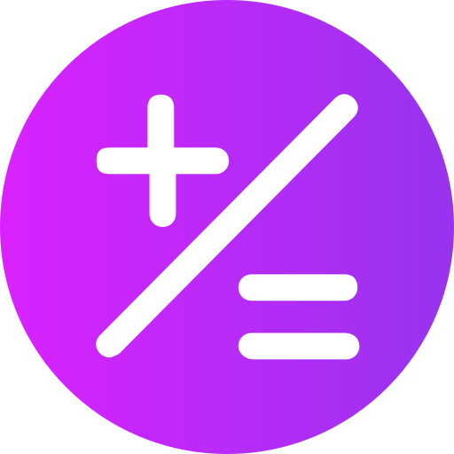
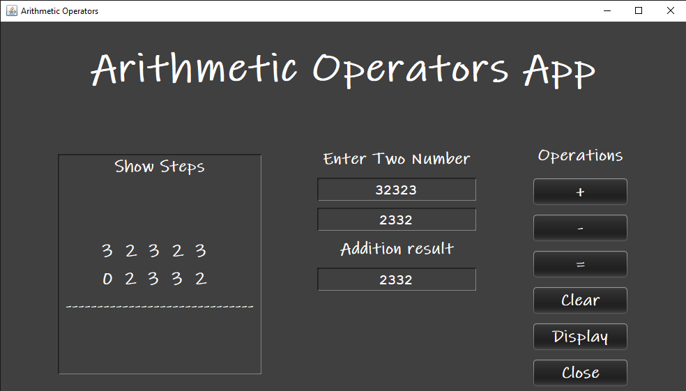
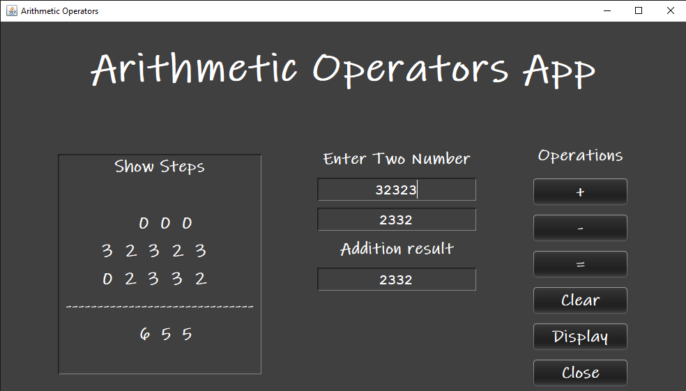

  <a href="https://github.com/MALEK-FRAIJ/Java-Arithmatic-Operation-.git">
  
# Java-Arithmatic-Operation

This is a simple GUI calculator app that will perform basic arithmetic operations like addition and subtraction only. The project is an application of what I learned in Java, showing step-by-step addition and subtraction and tracing parts of a byte.

# Java-Arithmatic-Operation Logo 

# 

- [Introduction](#introduction)
- [Java-Arithmatic-Operation Snapshot](#java-arithmatic-operation-snapshot)
- [Download Java-Arithmatic-Operation Desktop app](#download-java-arithmatic-operation-desktop-app)
- [Java-Arithmatic-Operation](#java-arithmatic-operation)

# Introduction 

This is a simple GUI calculator app that will perform basic arithmetic operations like addition and subtraction only. The project is an application of what I learned in Java, showing step-by-step addition and subtraction and tracing parts of a byte.

# Java-Arithmatic-Operation Snapshot

### Java-Arithmatic-Operation how it work

### Java-Arithmatic-Operation how it work

# Download Java-Arithmatic-Operation Desktop app

<h4>Link:
<a href="">Download Java-Arithmatic-Operation Desktop app</a> 
Password: OP1234
</h4>

# Java-Arithmatic-Operation

<h5>This is a simple calculator based on a graphical user interface, where many modes can be added and control the size and design of the buttons, it came as a practical application of what I learned in Java and object-oriented programming concepts where the swing library was used and some Layuot UI Manger was used.

Where you can learn step-by-step addition and subtraction, how numbers are processed, and how to delete them.</h5>

